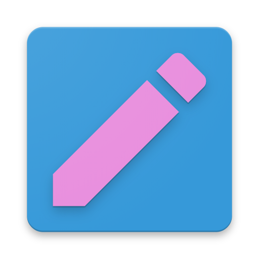

<!-- PROJECT SHIELDS -->
<!--
*** I'm using markdown "reference style" links for readability.
*** Reference links are enclosed in brackets [ ] instead of parentheses ( ).
*** See the bottom of this document for the declaration of the reference variables
*** for contributors-url, forks-url, etc. This is an optional, concise syntax you may use.
*** https://www.markdownguide.org/basic-syntax/#reference-style-links
-->
[![Issues][issues-shield]][issues-url]
[![MIT License][license-shield]][license-url]

<!-- PROJECT LOGO -->
 

  

  <h3 align="center">WebP Converter</h3>

  

      Simple to use image to WebP converter.
     
    <a href="https://github.com/MrSquirrelyNet/WebpConverter><strong>Explore the docs »</strong></a>
     
     
    <a href="https://github.com/MrSquirrelyNet/WebpConverter">View Demo</a>
    ·
    <a href="https://github.com/MrSquirrelyNet/WebpConverter/issues">Report Bug</a>
    ·
    <a href="https://github.com/MrSquirrelyNet/WebpConverter/issues">Request Feature</a>
  

<!-- TABLE OF CONTENTS -->
## Table of Contents

* [About the Project](#about-the-project)
  * [Built With](#built-with)
* [Getting Started](#getting-started)
  * [Prerequisites](#prerequisites)
  * [Installation](#installation)
* [Usage](#usage)
* [Roadmap](#roadmap)
* [Contributing](#contributing)
* [License](#license)
* [Contact](#contact)
* [Acknowledgements](#acknowledgements)

<!-- ABOUT THE PROJECT -->

## About The Project

[![Product Name Screen Shot][product-screenshot]](https://example.com)

This is a very simple to use Image to WebP converter. This program converts any images to Google's WebP Image format to save on space. This program is for people who download loads of images and wish to free up space to download more images!

### Built With

* [Material Design in XAML](https://www.nuget.org/packages/MaterialDesignThemes/3.1.0-ci981)
* [MahApps Metro](https://www.nuget.org/packages/MahApps.Metro/2.0.0-alpha0660)
* [Google WebP](https://developers.google.com/speed/webp)
* [Squirrel Sizer](https://www.nuget.org/packages/SquirrelSizer/)

<!-- GETTING STARTED -->

## Getting Started

Coming soon upon full release

<!-- ROADMAP -->

## Roadmap

See the [open issues](https://github.com/MrSquirrelyNet/WebpConverter/issues) for a list of proposed features (and known issues).

- Cross-platform support
  - Right now only Windows is supported, but I have the ability to support other platforms. I want to get the program up and running before I do so.

<!-- LICENSE -->

## License

Distributed under the GNU GPLv3 License. See `LICENSE` for more information.

I like this license for multiple reasons. I will not ever change the license so don't ask.

<!-- CONTACT -->
## Contact

James [@TheMrSquirrely](https://twitter.com/TheMrSquirrely) - james@mrsquirrely.net

Project Link: [https://github.com/MrSquirrelyNet/WebpConverter](https://github.com/MrSquirrelyNet/WebpConverter)

I rarely check my business email(so professional) so please just either DM on Twitter or submit an issue.

<!-- ACKNOWLEDGEMENTS -->
## Acknowledgements

* [Othneildrew Best Readme Template](https://github.com/othneildrew/Best-README-Template)
* [Jetbrains Resharper](https://www.jetbrains.com/)
* [Papa Musk](https://twitter.com/elonmusk)

<!-- MARKDOWN LINKS & IMAGES -->
<!-- https://www.markdownguide.org/basic-syntax/#reference-style-links -->
[issues-shield]: https://img.shields.io/github/issues/MrSquirrelyNet/WebpConverter.svg?style=flat-square
[issues-url]: https://github.com/MrSquirrelyNet/WebpConverter/issues
[license-shield]: https://img.shields.io/github/license/MrSquirrelyNet/WebpConverter.svg?style=flat-square
[product-screenshot]: images/screenshot.png